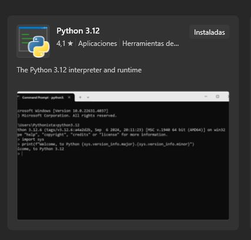

# Trabajo Practico Integrador de Par. y Len. de Prog. III
Este repositorio esta hecho para almacenar la progresion del trabajo final de web y base de datos. Donde se veran cosas como HTML, CSS, JAVASCRIPT, y las formas de diseñar una base de datos local y como conectares, hacer peticiones, carga de datos, etc.

# Link de la pagina
- El siguiente link deberia de mandar al usuario a la pagina para el testeo y ver el funcionamiento de la misma. En caso de no funcionar la del google docs se debe probar con este ya que se va a estar monitoreando en el caso de no funcionar.
- Al iniciar por primera vez en la pagina se debe opretar el boton AZUL que dice "Visit Site".
[Link de la pagina](https://trout-bright-reindeer.ngrok-free.app)

## Primer Avance
Se agrego la estructura de como sera la pag, puede estar sujetas a cambios en un futuro por las nuevas implementaciones que realizare, cada etiqueta tiene un comentario para imaginar como sera la pag. 

## Entrega del tp1
Se corrigio comentarios hacerca de mejoras hacia la pagina, se reestructura la estructura de carpetas para mayor orden. 
- Se implementaron la solicitud de listado_tabla.html pero se lo implemento en formato sidebar con un button que se despliega al opretar el listado de tablas con las peliculas que en este caso estan para alquilar.
- Se implemento en el carrousel el listado_box.html solo que en el carousel, la estructura box los tiene los nuevos lanzamientos en donde te dice que categoria e si comedia, cine, serie, etc.
- Para la muestra de un producto en particular, solo se lo agrego al opretar la img o el texto de la pelicula de Adam Sandler, en donde te da una pequeña cantidad de informacion.
- Para las comprar.html se agrego en el header un apartado en donde el usuario se puede registrar y realizar un pago de 1 pelicula en especifico, implementado lo aprendido hacerca de los formularios.

## Entrega del tp2 pero empezando el nuevo proyecto
- Funcion en python para descargar video.
- Servidor en python para enviar el video descargar usando flask.
- Script llamado python.js para realizar la conexion entre el frontend y el backend.
- Script llamado inc_global.js contador que validad y registrar el total videos descargados en la paginas.
- Hosting hecho en una maquina de mi propiedad.
- Paginas adaptativa.

## Instalacion/Requerimientos
- Instalar python, se puede usar la version que se encuentra en la Microsft Store. Ingresar el nombre de python en el buscador y deberan descargar este version.

- Tener [Node.js](https://nodejs.org/en) por las dudas.
- En caso de usar node.js se puede usar el comando `npm install`.
- En caso de no funcionar el `npm install`, usar lo siguiente para una instalacion manual, se uso Flask para el backend hecho en python `pip install Flask`y para el funcionamiento del script de descargar videos se usa la libreria `pip install yt-dlp`.
- Importar la libreria `import json` en el codigo de python para el manejo del archivo global.json
- Instalar Ngrok en caso de levantar a la red para pruebas y luego ejecutar el comando `ngrok http 5000`, pasar a alguien el enlace forwarding `https://d8f1-190-192-99-141.ngrok-free.app` esto solo es un EJEMPLO.

## Observacion o errores no corregidos.
- Al iniciar la pagina por primera vez y un usuario envia su primer solicitud a la pagina va a saltar un error que no se pudo corregir, solo pasa la primera vez que se inicia la pagina el error no vuelve a ocurrir despues de la primera solicitud, se espera solicionar ese error al final del trabajo.
- Se quitaron del frontend los redirecionamientos del login como son regirter y login.
- Se quito el section donde iba a ir todo la informacion de como se utilza la pagina.

  
